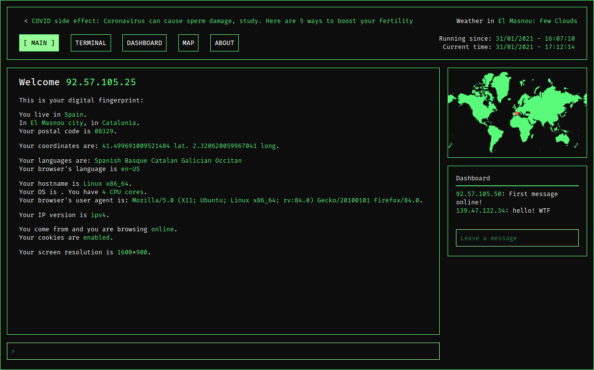

# WEB SPY
#### Video Demo: [https://youtu.be/NWhTLKR4A20](https://youtu.be/NWhTLKR4A20)
#### Description:

Web Spy is my submition for CS50's final project. It is a dynamic website built in Python's Flask whose main purpose is to alert users about how easy it is to extract data from them through IP checking and simple JavaScript. The site shows the user their browser fingerprint based on this methods. I'm aware (and the user should be) that this fingerprint is rather limited and there are far more insidious methods to get more precise tracking.

The site's main functionality is to check on the visitor's IP and and show their geolocation and ISP data, as well as some info on their browser. Those are some of the coordinates that most social media providers, as well as Google use to track unique IDs. Those IDs are then used to ensure that the user's web browsing experience is encompassed in a bubble of targeted ads and targeted content. The aforementioned bubble is becoming increasingly harder to circumvent.

The site stores its visitors IP as well as their geolocation coordinates through a SQL database, the same one used to store the dashboard messages. Among other flourishes (like the dashboard), a world map shows the visitor's location (powered through [smallworld.js](https://github.com/mikefowler/smallworld.js)), and the site's color scheme can be changed through "commands" on an input field mimicking a "terminal" input prompt. Even though the same effect could be achieved more easily and intuitively through a drop-down list, I think this quirk blends itself better with the "hackerish" aesthetics of the site (and it allows me to expand the list of commands available to the user when extending the functionality of the site).

The site is further divided into individual pages to account for mobile responsive design, as the dashboard and the map are hidden from the main page on a mobile viewport. The links in the layout, while in mobile, will collapse into a dropdown menu for easier navigation. The terminal page holds info on the available "commands" for individual IP checking and available color schemes.

IP checking is done through [https://ipapi.co/](https://ipapi.co/). The news marquee is achieved through [http://newsapi.org](http://newsapi.org) and the weather check based upon geolocation through [https://openweathermap.org/](https://openweathermap.org/)(both requiring an API key).

The site is presented somewhat as a "web portal" instead of as a simple single website anticipating a more ambicious project in the future.

Online version available at [http://web-spy.herokuapp.com/](http://web-spy.herokuapp.com/).
